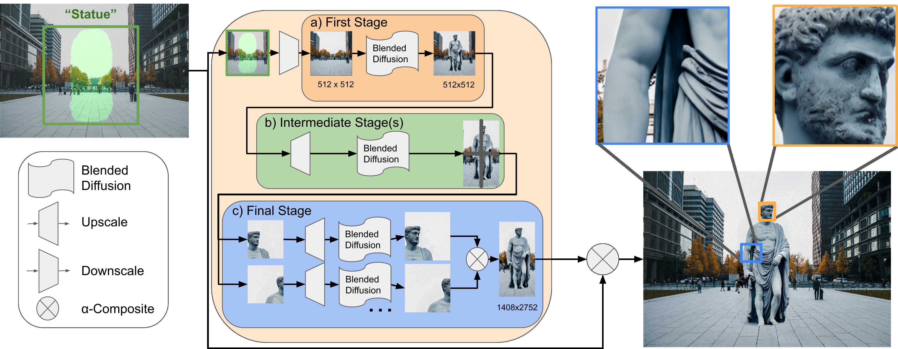

## High-Resolution Image Editing via Multi-Stage Blended Diffusion




<a href="https://replicate.com/arielreplicate/multi-stage-blended-diffusion"></a>

This repository includes our implementation of Multi-Stage Blended Diffusion, as described in our paper [High-Resolution Image Editing via Multi-Stage Blended Diffusion](https://arxiv.org/abs/2210.12965)

Our implementation builds on the original implementation of Latent Diffusion, available at (https://github.com/CompVis/latent-diffusion), which is licensed under the MIT license.
Specifically `multi-scale-blended-diffusion/ldm`, `multi-scale-blended-diffusion/configs`, and `multi-scale-blended-diffusion/models` are entirely from latent diffusion.

### Setup:

 * Install the environment specified in `multi-scale-blended-diffusion/environment.yaml`:
```
conda env create -f environment.yaml
```
 * Download the stable diffusion v1.4 from the [huggingface space](https://huggingface.co/spaces/stabilityai/stable-diffusion) and copy it to `multi-scale-blended-diffusion/models/ldm/stable-diffusion-v1/model.ckpt`.
  This requires login and has to be done manually.
 * Also download RealESRGANx4plus from [here](https://github.com/xinntao/Real-ESRGAN#inference-general-images) and place it in `multi-scale-blended-diffusion/RealESRGAN_x4plus.pth`:
```
wget https://github.com/xinntao/Real-ESRGAN/releases/download/v0.1.0/RealESRGAN_x4plus.pth -P multi-scale-blended-diffusion/
```
### Usage
To try our approach for interactive editing, use the [`multi-scale-blended-diffusion/InteractiveEditing.ipynb`](multi-scale-blended-diffusion/InteractiveEditing.ipynb) notebook.

To run, validate our approach on the examples used in our paper, use [`multi-scale-blended-diffusion/blended_latent_diffusion.py`.](multi-scale-blended-diffusion/InteractiveEditing.ipynb)
